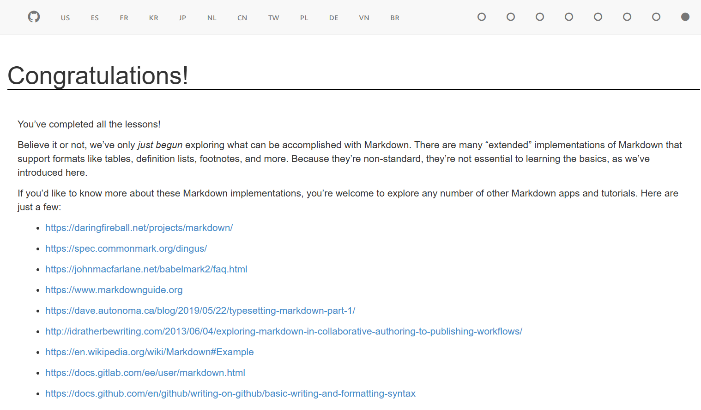

# Markdown

## Oppgave 1

### Markdown Tutorial

## Oppgave 2

Nettside 1 leder til en tutorial for den beste README.md filen, den kan man bruke for å lage en bra og lav insats README.md fil uten å måtte finne på noe nytt hver gang.

Nettside nummer 2 kan man bruke til å lage en "Cheatsheet" for Markdown syntax.

## Oppgave 3

**Oppgaven krevde å lage en annen fil, her er den:**
*[Brage text](Brage.md)*

## Oppgave 4

**[Ikke "klikk her"](https://dm.tools/tracker)**

## Oppgave 5

## Oppgave 6

'''
print ("Hello world")
'''

